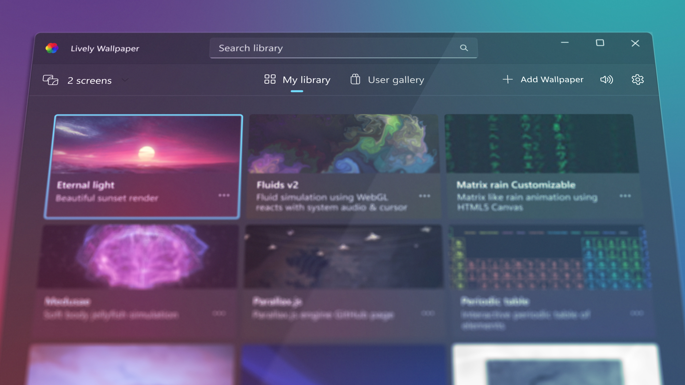

  
  <h2 align="center">Deadly Wallpaper</h2>

A spitefully ported "re-imagining" of the Windows desktop application "Lively Wallpaper", but better and built for Linux, Mac, and Windows.

Originally, this was just a faithful Linux port in the original language C#, but im throwing this into a branch to-be-forgotten, then im rewriting this in a significantly more refined language, Rust. AI will be used to parse through the mountains of C# boilerplate.
